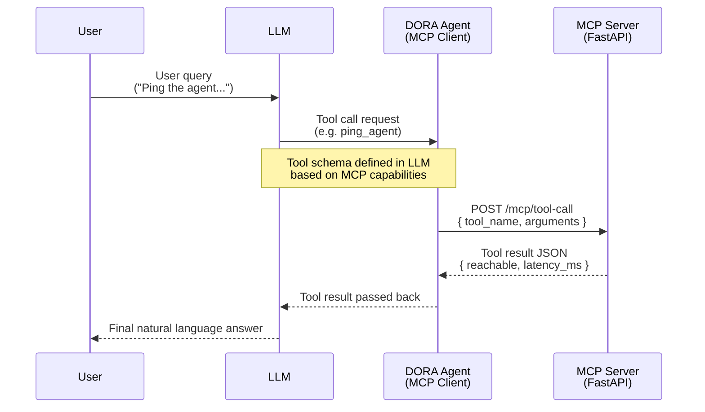
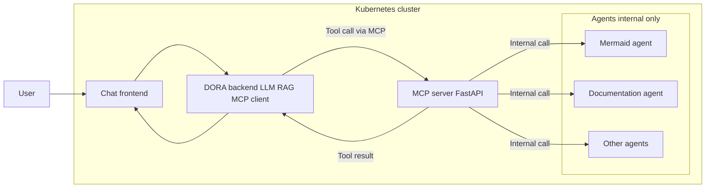

# DORA MCP server

This repository contains the source code for the DORA MCP (Model Context Protocol) server. The DORA MCP server is designed to facilitate communication and data exchange between different components of the DORA system using the MCP protocol. 

## DORA MCP based architecture 

This sequence diagram illustrates the interaction flow between a user, a large language model (LLM), a DORA Agent (acting as an MCP client), and the MCP Server (implemented with FastAPI):

1. The user sends a query to the LLM (e.g., "Ping the agent...").
2. The LLM issues a tool call request to the DORA Agent, referencing a tool schema defined in the LLM based on the MCP server's capabilities.
3. The DORA Agent sends a POST request to the MCP Server with the tool name and arguments.
4. The MCP Server processes the request and returns the result as JSON (including fields like `reachable` and `latency_ms`).
5. The DORA Agent passes the tool result back to the LLM.
6. The LLM provides a final natural language answer to the user.

This diagram highlights how the LLM leverages the MCP protocol to interact with external tools via the DORA Agent and MCP Server, enabling dynamic tool use and response generation.

## DORA system architecture

The DORA platform consists of **three main component groups**, all running inside a **Kubernetes cluster**, except for the end user who interacts from the outside.

---

### 1. MCP Server (Central Integration Layer)

The MCP server is the central orchestrator that exposes a standardized interface (Model Context Protocol) to the DORA backend.

#### Responsibilities

- Provides MCP endpoints over internal HTTP:
  - `/mcp/capabilities`
  - `/mcp/resources`
  - `/mcp/tools`
  - `/mcp/tool-call`
- Represents tools and resources to the LLM indirectly through the DORA backend.
- Forwards tool-call requests to the appropriate agent running inside the cluster.
- Acts as an internal “plugin router,” abstracting away individual agent implementations.

#### Deployment characteristics

- Runs as a **Deployment + ClusterIP Service**.
- **Not exposed externally**.
- Accessible only to:
  - the DORA backend,
  - optionally internal system services.

---

### 2. DORA Agent (Backend + Frontend)

The DORA Agent is composed of two parts, both running inside the Kubernetes cluster.

#### 2.a DORA Backend

The backend is the **intelligence and orchestration core** of the system.

##### Responsibilities

- Handles communication with the LLM provider (OpenAI, Gemini, etc.).
- Implements:
  - tool/function calling,
  - RAG integration (vector database, document retrievers, embeddings),
  - conversation management,
  - MCP client logic.
- When the LLM requests a tool call, the backend:
  1. translates the request into an MCP tool-call,  
  2. sends it to the MCP server,  
  3. receives the tool result,  
  4. returns it to the LLM.

##### Deployment characteristics

- Runs as a **Deployment + ClusterIP Service**.
- Accessible only inside the cluster.
- Communicates with the chat frontend and the MCP server.

---

#### 2.b Chat Frontend

The chat frontend is the **only externally accessible** component of the platform.

##### Responsibilities

- Provides a Web UI or chat interface to the user.
- Sends user messages to the DORA backend via internal HTTP or WebSocket.
- Displays the final responses produced by the LLM (through the DORA backend).

##### Deployment characteristics

- Runs as a **Deployment behind an Ingress**.
- Exposed publicly via HTTPS (e.g., `https://dora.cloudmentor.hu`).
- Does **not** talk directly to the MCP server or agents.

---

### 3. Agents (Internal Functional Services)

Agents are the **task-specific worker services**, each responsible for a specialized capability.

#### Examples

- Mermaid diagram generator  
- Documentation writer  
- Code analyzer  
- Log summarizer  
- Security scanner  
- Any custom domain-specific microservice  

#### Responsibilities

- Execute the actual task requested by the LLM (via MCP).
- Provide outputs such as diagrams, summaries, code, or analysis results.

#### Deployment characteristics

- Each agent runs as a **separate Deployment + ClusterIP Service**.
- Agents are **internal only**:
  - No Ingress  
  - Not reachable from the internet  
  - Not accessible by the user  
- Only the **MCP server** can call them using the Kubernetes internal network.  
  Example:  
  `http://mermaid-agent.agents.svc.cluster.local`

- Kubernetes NetworkPolicies can enforce:
  - MCP server → agents only
  - deny everything else

This makes agents isolated, secure, and horizontally scalable.

---

### Mermaid Flowchart

Below is the validated, parentheses-free, line-break-free, fully working Mermaid flowchart that matches the architecture:

## Other DORA components

- Basic DORA solution with LLM integration: https://github.com/cloudsteak/dora
